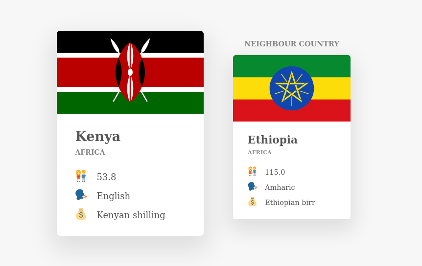

# GET POSITION
A function 'whereAmI' which renders a country's details based on GPS coordinates.

## Author
The app is an original idea of [Jonas Schmedtman](www.jonas.io)

## Features

- Vannila JS
- Geocoding
- Asynchronous JavaScript - promises
- Fetching from API
- Advanced Objects Lookup
- Destructuring

## Screen shots

## Implementation
- [x] 'reverse geocoding' of the provided coordinates. https://geocode.xyz/api
- [x] Chain a catch method to the end of the promise chain and log errors to the console
- [x] Render the country and catch any errors.

>NB: This API allows you to make only 3 requests per second.
